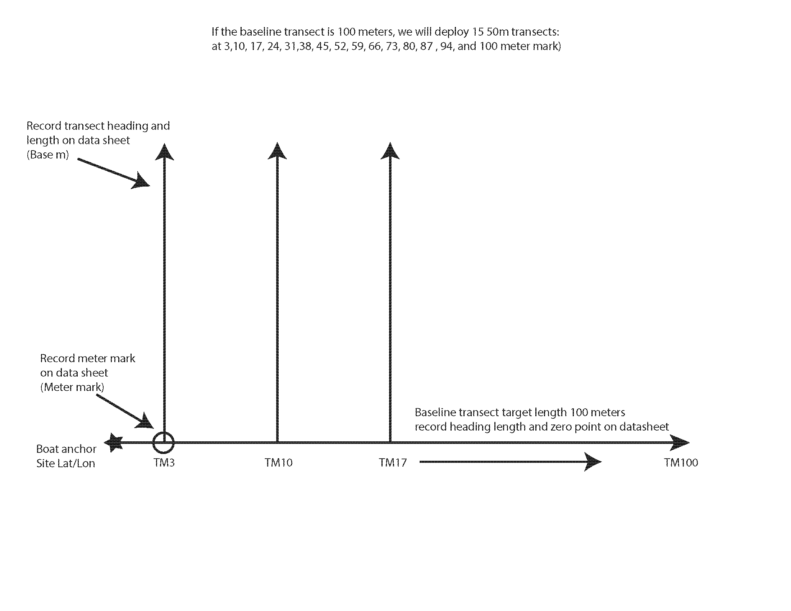
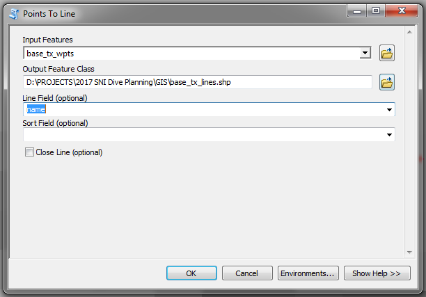
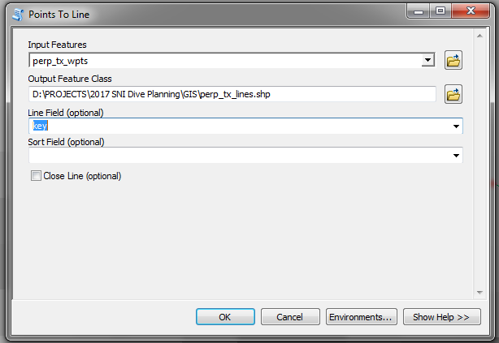
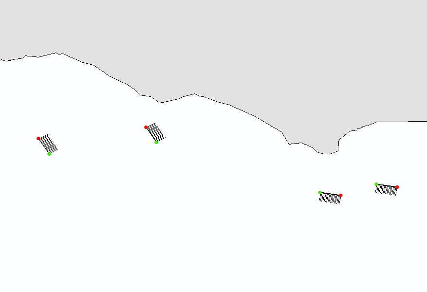

# Overview
The goal of this exercise is to automatically generate baseline and perpindicular transects from a set of sites with the start position (latitude, longitude), bearing, and length. The sampling design was developed by Dave Witting. In brief, a baseline transect 100-m long was placed to occur in rocky habitat at various locations around San Nicolas Island. Perpendicular transects, 50-m in length, were then placed at 6-m intervals, beginning at the 3-m mark, and extending to the end of the transect (a total of 17 50-m transects along a baseline transect 100-m long).  

This tool takes user input from an Excel (.xlsx) file to create the baseline transects, then create perpindicular transects along the length of the baseline transect. The Excel file has information on the 1) start location (latitude/longitude; decimal degrees), bearing (compass heading, degrees), and desired length (km) of each baseline transect, and the 2) bearing (typically -90/90; degrees), start location along the baseline transect (km), and desired spacing (km). 

The tool produces comma-delimited text files (.csv) and GIS shapefiles (.shp) containing the start and end locations of the baseline and perpendicular transects. 



# Load libraries and set-up document
```{r LoadLibraries, echo=FALSE, error=FALSE, message=FALSE, warning=FALSE}
rm(list=ls())
# List packages required to run the script
pkgs <- c("ggplot2","pander","swfscMisc","sp","lubridate","plyr",
          "knitr","xlsx","rgdal","ggmap","raster","leaflet","maps","maptools")
# Install and load all packages provided from a character vector
load_pkgs = function(pkgs){
  new_pkgs = pkgs[!(pkgs %in% installed.packages()[ ,'Package'])]
  if(length(new_pkgs) > 0) install.packages(new_pkgs)
  invisible(lapply(pkgs,function(x)
    suppressPackageStartupMessages(library(x,character.only=TRUE))))
}
# Load packages
load_pkgs(pkgs)
# set system time zone to GMT
Sys.setenv(tz = "GMT")
# global knitr chunk options
knitr::opts_chunk$set(warning=FALSE, message=FALSE,fig.align='center')
# global pander options
panderOptions('table.style','rmarkdown'); panderOptions('table.split.table', Inf); panderOptions('digits', 6);
panderOptions('round', 6); panderOptions('keep.trailing.zeros', TRUE); panderOptions('missing', "")
```

```{r UserInput}
# Select tile to use for Leaflet map
# Some good options include CartoDB.Positron, Stamen.Terrain, Esri.WorldImagery
leaflet.tile <- "Stamen.Terrain" 
```


```{r Functions,echo=FALSE}
points2line <- function(data, long, lat, id_field = NULL, sort_field = NULL) {
  # Convert to SpatialPointsDataFrame
  coordinates(data) <- c(long, lat)
  # If there is a sort field...
  if (!is.null(sort_field)) {
    if (!is.null(id_field)) {
      data <- data[order(data[[id_field]], data[[sort_field]]), ]
    } else {
      data <- data[order(data[[sort_field]]), ]
    }
  }
    # If there is only one path...
  if (is.null(id_field)) {
    lines <- SpatialLines(list(Lines(list(Line(data)), "id")))
    return(lines)
    # Now, if we have multiple lines...
  } else if (!is.null(id_field)) {  
    # Split into a list by ID field
    paths <- sp::split(data, data[[id_field]])
    sp_lines <- SpatialLines(list(Lines(list(Line(paths[[1]])), "line1")))
      # I like for loops, what can I say...
    for (p in 2:length(paths)) {
      id <- paste0("line", as.character(p))
      l <- SpatialLines(list(Lines(list(Line(paths[[p]])), id)))
      sp_lines <- spRbind(sp_lines, l)
    }
    return(sp_lines)
  }
}
```

# Set location and import site information

```{r LoadSiteData}
# Read dive site info from Excel file
sites <- read.xlsx("../Data/sni_sites.xlsx",sheetName = "sites")
# Create placeholders for destination data
sites$lat_end <- NA
sites$lon_end <- NA
```

# Create baseline transects

```{r ComputeBaselineDestinations}
# Calculate the destination from the origin
for(i in 1:nrow(sites)){
  # calculate the baseline endpionts
  temp.starts <- destination(sites$lat_start[i],sites$lon_start[i],brng = sites$base_brng[i],distance = sites$base_distance[i],units = "km")
  sites$lat_end[i] <- temp.starts[grep("lat",names(temp.starts))]
  sites$lon_end[i] <- temp.starts[grep("lon",names(temp.starts))]
}
# Write results to text file
write.csv(sites,file = "../Output/site_info_R.csv",quote=FALSE,row.names=FALSE)

base.tx.starts <- sites[,c("name","lat_start","lon_start")]
base.tx.starts$location <- as.factor("Start")
names(base.tx.starts) <- c("name","lat","lon","location")
base.tx.ends <- sites[,c("name","lat_end","lon_end")]
base.tx.ends$location <- as.factor("End")
names(base.tx.ends) <- c("name","lat","lon","location")

base.tx.wpts <- rbind(base.tx.starts,base.tx.ends)

base.tx.wpts$key <- paste(base.tx.wpts$name,base.tx.wpts$location)
write.csv(base.tx.wpts,file = "../Output/sni_base_tx_wpts.csv",quote = FALSE,row.names = FALSE)

# Convert baseline transect waypoints to line
baseline.lines <- points2line(data = base.tx.wpts, 
                          long = "lon", 
                          lat = "lat", 
                          id_field = "name")

# create spatial points data frame
base.tx.shp <- base.tx.wpts
# define coordinates
coordinates(base.tx.shp) <- ~lon+lat
proj4string(base.tx.shp) <- CRS("+init=epsg:4326")

# write baseline transect waypoint to shapefile
writeOGR(base.tx.shp, "../GIS", "base_tx_wpts", driver = "ESRI Shapefile",overwrite_layer=TRUE)
```

# Create perpindicular transects from baseline transects

```{r ComputePerpendicularTransects}
# Create a data frame for results
perp.tx.wpts <- data.frame()
for(i in 1:nrow(sites)){
  # Define the transect interval along the baseline transect
   # Start position, end position, and interval, based on user input regarding spacing and baseline transect length
  tx.interval <- seq(sites$perp_start[i],sites$base_distance[i],sites$perp_spacing[i])
  # calculate perpindicular transect start locations for baseline transect i
  temp.starts <-destination(sites$lat_start[i],sites$lon_start[i],brng = sites$base_brng[i],distance = tx.interval,units = "km")
  # assemble into a data frame and format
  perp.tx.starts <- data.frame(temp.starts[grep("lat",names(temp.starts))],temp.starts[grep("lon",names(temp.starts))])
  names(perp.tx.starts) <- c("lat","lon")
  perp.tx.starts$location <- as.factor("Start")
  perp.tx.starts$position <- as.factor(paste("T",tx.interval*1000,sep=""))
  # calculate perpindicular transect end locations for baseline transect i  
  temp.ends <- destination(perp.tx.starts$lat,perp.tx.starts$lon,brng = sites$base_brng[i] + sites$perp_bearing[i],distance = sites$perp_distance[i],units = "km")
  # assemble into a data frame and format    
  perp.tx.ends <- data.frame(temp.ends[grep("lat",names(temp.ends))],temp.ends[grep("lon",names(temp.ends))])
  names(perp.tx.ends) <- c("lat","lon")
  perp.tx.ends$location <- as.factor("End")
  perp.tx.ends$position <- as.factor(paste("T",tx.interval*1000,sep=""))
  # combine start and end locations for base transect i
  perp.tx.wpts.temp <- rbind(perp.tx.starts,perp.tx.ends)
  # add the site name
  perp.tx.wpts.temp$name <- sites$name[i]
  perp.tx.wpts.temp$region <- sites$region[i]
  # create a key from the site name and position along the baseline transect
  perp.tx.wpts.temp$key <- paste(perp.tx.wpts.temp$name,perp.tx.wpts.temp$position)
  # combine with previous results
  perp.tx.wpts <- rbind(perp.tx.wpts,perp.tx.wpts.temp)
}
row.names(perp.tx.wpts) <- NULL
# write results to CSV file
write.csv(perp.tx.wpts,file="../Output/sni_perp_tx_wpts.csv",quote = FALSE,row.names = FALSE)

# Convert baseline transect waypoints to line
perp.lines <- points2line(data = perp.tx.wpts, 
                          long = "lon", 
                          lat = "lat", 
                          id_field = "key")

# create spatial points data frame
perp.tx.shp <- perp.tx.wpts
# define coordinates
coordinates(perp.tx.shp)<-~lon+lat
proj4string(perp.tx.shp) <- CRS("+init=epsg:4326")

# write baseline transect waypoint to shapefile
writeOGR(perp.tx.shp, "../GIS", "perp_tx_wpts", driver = "ESRI Shapefile",overwrite_layer=TRUE)
```

# Map of baseline and perpendicular transects
This is an interactive Leaflet map. If an internet connection is available, the basemap will be drawn. If not, the background will likely remain gray, but the transects and waypoints should still plot, and the map should remain interactive.

```{r LeafletMapAll,fig.width=13,fig.height=9}
leaflet() %>%
            addProviderTiles(leaflet.tile) %>%
            addPolylines(data = perp.lines,weight=2,color = 'green')  %>%
            addPolylines(data = baseline.lines,weight=2,color = 'black') %>%
            addMarkers(data = base.tx.wpts,~lon,~lat,popup = ~key)
```

# Convert points to lines in GIS (if desired)
Using the Points to Line tool in ArcGIS, convert the baseline and perpindicular transect waypoints to lines.


## Convert baseline transect waypoints to lines
When converting the baseline transects, use the following options, taking particular care with the Line Field choice (**name**, in this case).



## Convert perpenducular transect waypoints to lines
When converting the perpendicular transects, use the following options, taking particular care with the Line Field choice (**key**, in this case).



## Add line layers to GIS
When added to ArcGIS, the baseline and perpendicular transects should look something like this.  

 

# End of document